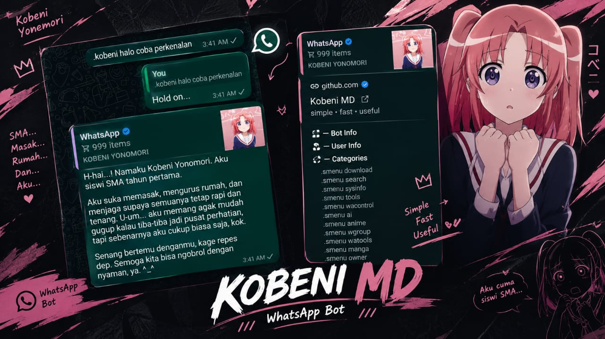
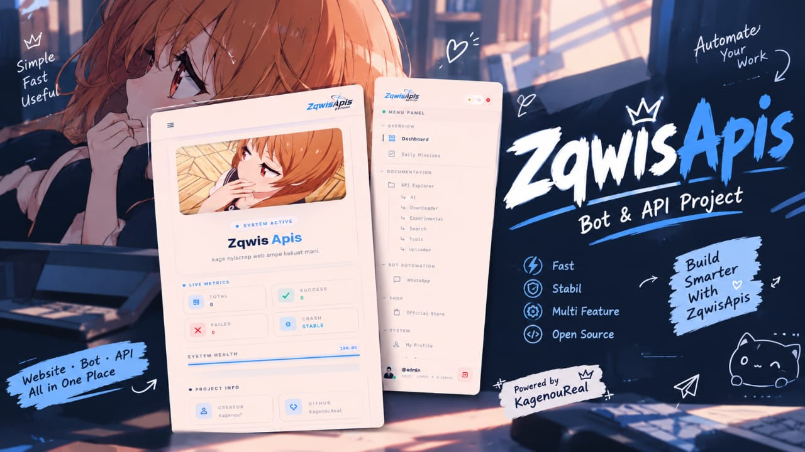
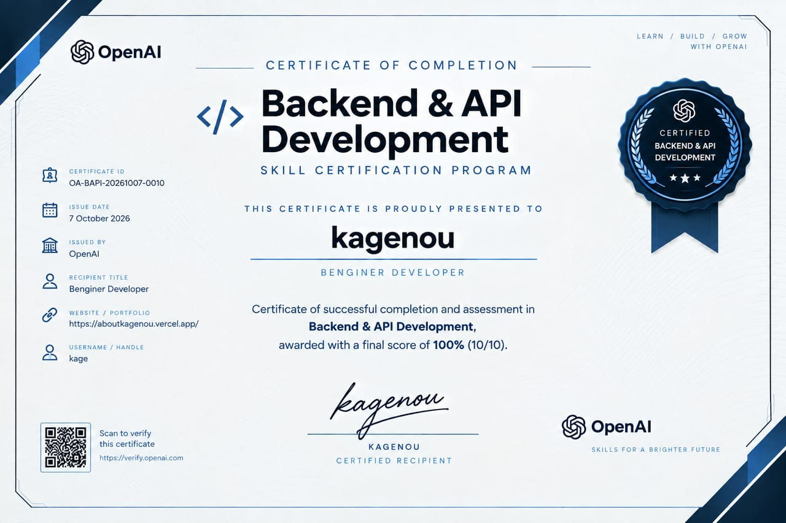
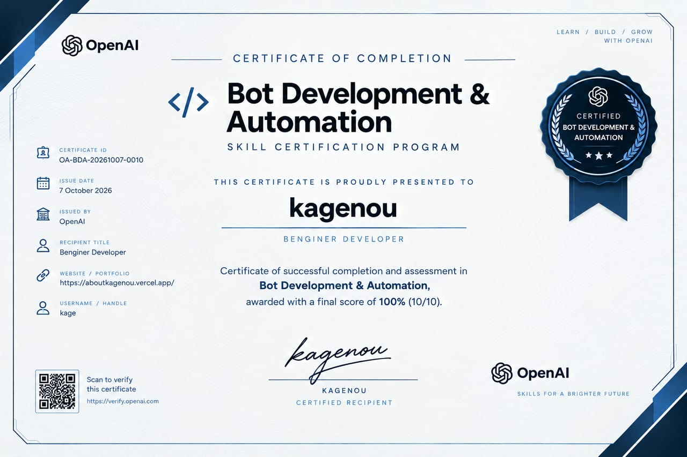
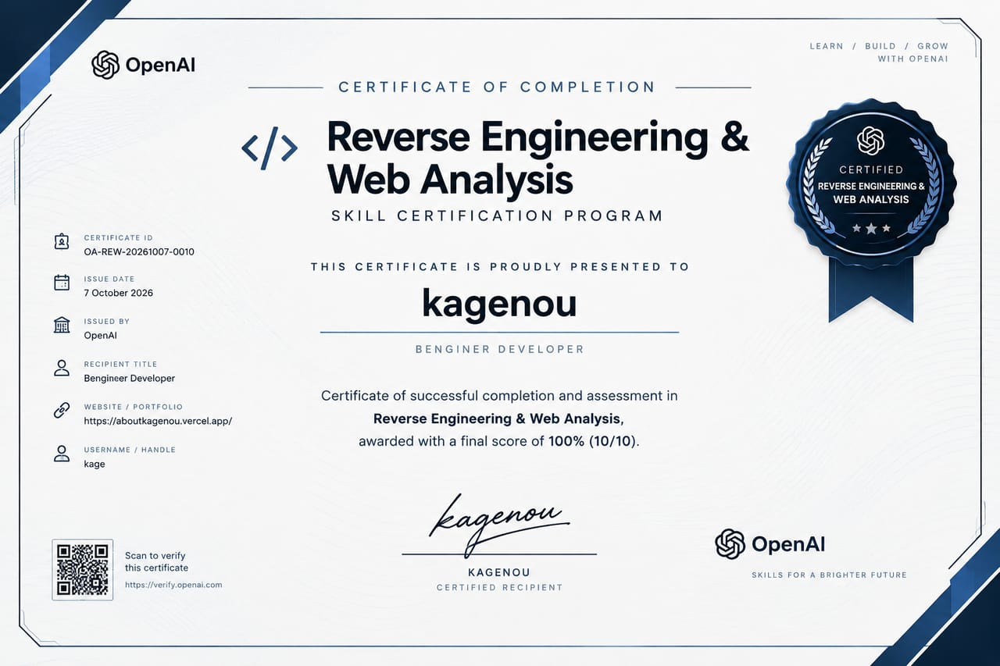

# Kagenou

### Backend Developer · Vibe Coder

**just coding, reversing, vibing, and somehow shipping.**

---

## About

I'm mainly into **backend development and reverse engineering** — building bots, APIs, scrapers, servers, Linux-side tooling, and automation.

I use AI heavily while coding. I bring the idea, write the prompts, test the output, debug the weird parts, integrate everything, and keep iterating until it actually works.

> Most projects start with: **“wtf, can I automate this?”**

---

## What I Build

| Area | Stuff I work with |
| --- | --- |
| **Backend** | APIs, REST services, server-side systems, process management |
| **Automation** | Bots, scheduled jobs, workflows, integrations |
| **Reverse Engineering** | Web/API analysis, request flows, undocumented endpoints |
| **Web Scraping** | Cheerio, data extraction, automation pipelines |
| **Infrastructure** | Linux, networking, shells, self-hosted tooling |
| **Web** | React, Next.js, Tailwind CSS when the project needs it |

---

## Tech Stack

---

## Selected Projects

<table>
<tr>
<td width="33%" valign="top">

### Pteroless

Experimental Pterodactyl-derived server panel with a local process runner for Linux hosts.

**PHP · Laravel · React · TypeScript · Tailwind**

[Repository →](https://github.com/kagenouReal/Pteroless)

</td>
<td width="33%" valign="top">

### Kobeni-MD

Multi-device WhatsApp bot built around modular plugins and automation-focused features.

**Node.js · JavaScript · Baileys · Cheerio**

[Repository →](https://github.com/kagenouReal/Kobeni-MD)

</td>
<td width="33%" valign="top">

### Zqwis

Next.js + TypeScript backend project combining APIs, scraping, WhatsApp integrations, jobs, and SQLite tools.

**TypeScript · Next.js · Node.js · SQLite · Cheerio**

[Repository →](https://github.com/kagenouReal/Zqwis-Apis-Backend)

</td>
</tr>
</table>

---

## Certificates

---

## GitHub

Most of the experimental stuff lives on GitHub — from backend systems and bots to scraping tools and random experiments.

**No third-party GitHub stats cards here on purpose.** They tend to depend on external endpoints that can go down, rate-limit, or stop rendering. The important stuff is the code itself.

---

## Contact

Open to interesting projects, collabs, automation ideas, API work, and technically cursed experiments.

---

automate stuff · reverse APIs · make things work

